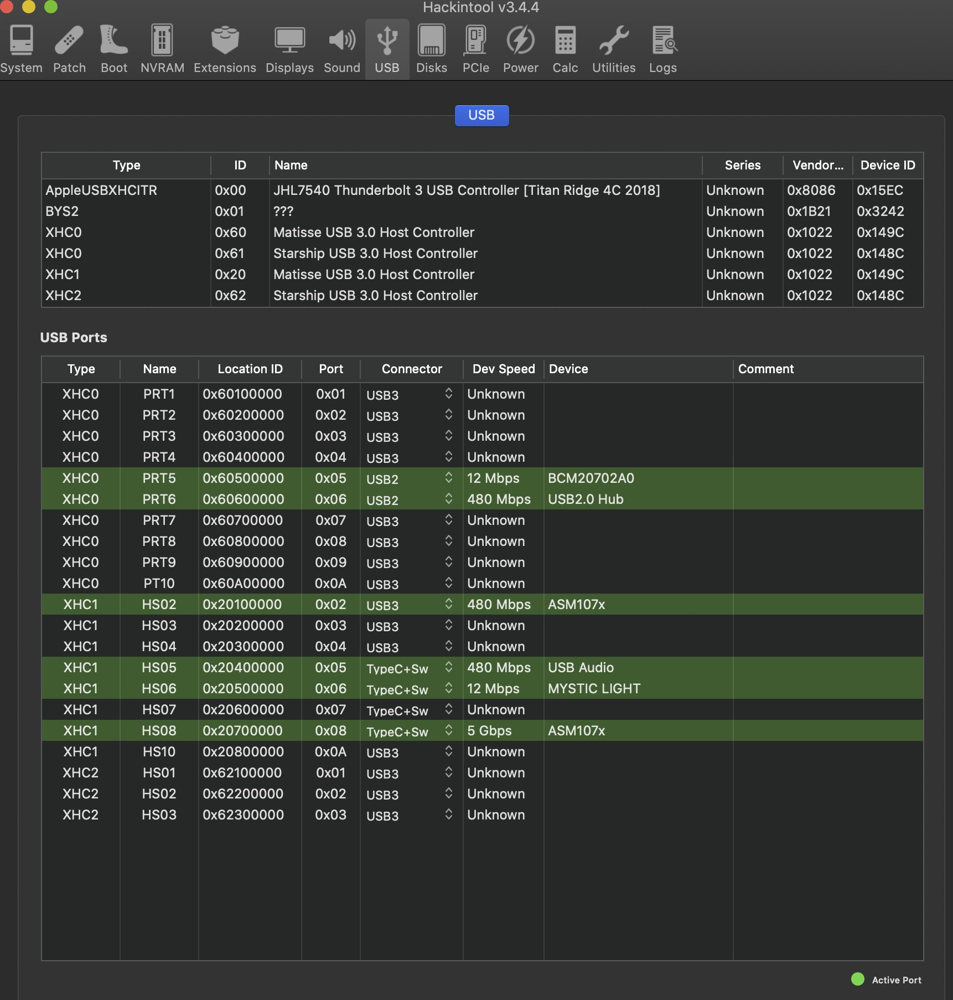
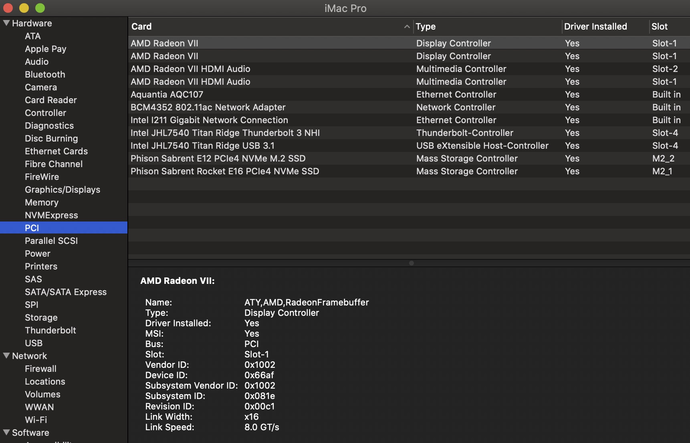

# OpenCore EFI for TRX40 Threadripper - AMD Hackintosh Bare Metal

This repository provides the basic contents for an EFI folder to successfully boot "bare metal" MacOS on a __TRX40-based__ motherboard, using a Threadripper CPU, such as a 3960X, 3970X or 3990X. This repository will  be somewhat  generic and atttempt to discuss most TRX40 motherboards based on input from fabiosun's work at this [site](https://www.macos86.it/topic/3307-trx40-bare-metal-vanilla-patches-yes-it-worksbutproxmox-is-better/#comments). To date (see dates of this repository at bottom of  this Intro) the EFI should boot   _Catalina_ or _Big Sur_ (the latter in beta). The intended SMBIOS is _iMacPro1,1_ although provisions are available for running _MacPro7,1_ which will be described below.

This repository is only designed for the OpenCore bootloader. __OpenCore__ (OC) is best updated via Pavo's [OCBuilder](https://github.com/Pavo-IM/ocbuilder/releases) app. Accordingly, if you have a working EFI boot folder, based on this repository, you can update various components of it as you see fit using OCBuilder. But do be careful not to over write files or folders unique to this build. If updated, please study the Docs folder in OpenCore to see if the structure of the __config.plist__ file needs to be changed (this respository will attempt to be current with the most stable release). Keep in mind that OpenCore is evolving, and consequently, new versions can substantially effect the overall structure and functioning of your __config.plist__ file. I feel that editing is best done using PlistEdit Pro or [ProperTree](https://github.com/corpnewt/ProperTree). While [OpenCore Configurator](https://mackie100projects.altervista.org/download-opencore-configurator/) may be used, if it is out of date with your OpenCore commit, you can get corruption of the __config.plist__ file which you may not notice for some time (and even find difficult to track down and correct).

The EFI folder in this repository should be placed on the EFI partition of your boot drive. Don't make the rooky mistake of placing the contents of the EFI folder of this repository on the EFI partition. Instead, the EFI partition contains an EFI folder, which in turn contains the Boot and OC folders.

OpenCore version numbers are not incremented for each minor adjustment, but incremented once stable. However, there are dates of commits indicated within each version before the version number is incremented. While there may  be only small changes within a version, the changes can have marked structural changes and yet not be fully documented. Accordingly, it is best to use final release versions. Due to the sometimes daily changes, this repository will only upload changes if the commit seems stable and then note the date of compilation along with the version number. 

The present EFI folder is: 

***v061 - 8/9/2020***

***Commentary Update - 8/19/20***

## A. Contents

### 1. ACPI

The SSDT files nomenclature and structure reflect the generic nature of this repository. The SSDT files are numbered, partlly to indicate the correct order of their loading, and partly to to separate them for different motherboards.

Those numbered 0 to 9 should apply for all TRX40 motherboards. Those numbered from 10-19 for MSI motherboards; 20-29 for Gigabyte motherboards and 30-39 for ASRock motherboards. 50-59 are reserved for add-in-cards (AIC). The one included example is for a Gigabyte Titan Ridge Thunderbolt AIC (GB-TR-TB3-AIC). This TB card is meant to be placed in Slot 4 (PCIe4), It  was flashed firmware NVM 33. The SSDT for this is _50-SSDT-TRX40-GB-TR-AIC-Slot4-v5.aml_. The internal USB of TB3 is assigned XHC5, which does not conflict with the renames discussed below.

VIrtually all SSDT files numbered greater than 9 are simpy to re-name devices and may not be essential for any functional improvement. An exception to this, are thunderbolt SSDT which are essential for proper functionality. 

While SSDT files can inject function, those are not presented here. The included SSDT files can have properties to inject added to them; an example will be described later. Some information that can be injected will help to populate System Information's PCI section as shown below.

The GPU SSDT files, _5-SSDT-TRX40-GFX0.aml_ and _5-SSDT-TRX40-GFX0-FGX1.aml_  provide correct re-naming of the devices (although much is provided by WEG). The first file is for single GPU located in slot 1; the second for dual GPU systems located in slots 1 and 3.

There are SSDT files to rename NVMe drives such a _12-SSDT-TRX40-NVMe-ANSx.aml_. This files, since it's numbered "12" is meant for an MSI mobo. It will rename 3 NMVe drives as written. Unless data to inject is added, the SSDT file will not contribute information to the System Information/PCI section. However, by simply renaming the device, the desktop disk icons are forced to be updated and changed from external to internal icons. 

The SSDT file _12c-SSDT-TRX40-NVMe-ANSx-Inject.aml_ is provided as an example of how to inject data about a device, in this case an NVMe drive, to System Information's PCI section. If you open it to edit (use MaciASL), you'll see near the top a reference to "DTGP". This external method is kept in the ACPI folder and is the 2nd one called in the entries (_1-SSDT-DTGP.aml_); this file must be present for everything to properly  work.

The information changes in these files should be changed to reflect the brand and sizes of NVMe drives that you are using in your build. For example, if ANS1 presently indicates that the NVMe SSD is "Corsair Force 600 NVMe 1TB SSD". And if your SSD is a Samsung, then change the name (and model) to something like "Samsung PRO 970 NVMe 512GB SSD ". Such editing can be accompished by studying the files (don't expect much hand-holding with these modifications).

There are sets of SSDT files which rename the various USB devices on the TRX40 builds. The ones named DOB8 and D1B8 are common to all builds and are renamed to XHC1 and XHC2, respectively.

### 2. Kexts

The contents of the Kexts folder can be broken down into various groups.

The first grouping are the essential kexts: AppleALC, AppleMCEReporterDisabler, Lilu, SmallTreeIntel82576-I211, VirtualSMC and WhateverGreen (WEG). Within the __config.plist__ file, in the Kernel section, Lilu must be first in order, followed by VirtualSMC. Similarly, WEG should be present before other graphics related kext files.

The second groupding are the BT/Wifi kexts: AirportBrcmFixup, BrcmBluetoothInjector, BrcmFirmwareData, and BrcmPatchRAM3. If you've swapped out the stock Intel BT module for a Mac-compatible version you'll want all of these enabled within the __config.plist__ file. On the other hand, if you've added a PCIe BT/WiFi card such as the Fenvi FV-T919 (with a Broadcom 94360CD), then most of these kext files are optional.

To delete an internal BT/Wifi device (AX200), the following can be done:.....................................(to be completed)

Note, there are recent concerns with sleep issues, jitterey mouse and computer freezes with Radeon VII and Radeon 5700XT graphics cards. It appears to be an issue with WEG. If you are using these cards (and perhaps even any 5x00 card), try disabling WEG and re-booting the system to see if the issues are resolved. When WEG is disabled, you might notice some cosmetic glitches, such as pink/purple lines at the top of the screen, during boot (while the Apple logo progress bar is on-going). These are  inconsequential, so don't worry about them (WEG normally surpresses them without you're knowing it). This problem does not seem to be an issue with older grapics cards.

MacProMemoryNotificationDisabler is only to be enabled when using SMBIOS _MacPro7,1_ (which requires Catalina). __Please note: the most stable setup is SMBIOS iMacPro1,1.__ This SMBIOS is closest to our build. If you have trouble while using MacPro7,1, you were warned and don't ask for help; instead, sign out of iCloud and then change the SMBIOS to iMacPro1,1.

[SMCAMDProcessor](https://github.com/trulyspinach/SMCAMDProcessor) is useful for providing CPU temperature and frequency information. Presently, it is unstable with Catalina and Big Sur with the TRX40 running bare metal. Please refer to its GitHub for the latest updates and for downloading the associated AMD Power Gadget app which presents the data. _AMDRyzenCPUPowerManagement.kext_ and AMD Power Gadget app is stable with Catalina, but not Big Sur.

The above kext files may be updated independent of this repository using [Hackintool](https://www.insanelymac.com/forum/topic/335018-hackintool-v286/), [Kext Updater](https://bitbucket.org/profdrluigi/kextupdater/downloads/) or [OCBuilder](https://github.com/Pavo-IM/ocbuilder/releases). 

See the Hackintools image for USB details below. This image reflects using the included SSDT files for complete renaming of the USB devices. WIthout the use of these SSDT files, the Hackintool USB section would be empty of all devices.

### 3. System Information / PCI

This section shows the current status of the System Information section in Mac OS. The image shown represents the various devices being re-named by the DevicesProperties section of OC, some of which are included in the _config.plist file_.

Aside from providing information to the PCI section (which is mostly costmetic, so nothing to worry about if allowed to remain empty), from SSDT files, the OpenCore DeviceProperties (DP) section can inject this data as well. Here is a section of DP showing injection of NVMe drives for the MSI TRX40 Creator mobo. The arrow points to a _#_ symbol. This symbol in OpenCore inactivates an entry. All DP entries in the supplied _config.plist_ file are inactivated. Simply delete the _#_ symbol to activate.

The device pathway is derived from Hackintool by selecting the PCIe tab at top then the red high-lighted button at the bottom of the window:

After clicking on the button, a window will open with a highlighted text file. In this example, the drives are highighted. By copying and pasting into OpenCore's DP section shown above (and editing the actual entry data), you can custom this section for your own build. After rebooting, this data will show up in the System Information PCI section.

### 4. Drivers

Only a few drivers are required with OpenCore: HSSPlus, OpenCanopy and OpenRuntime. AudioDxe, CrScreenshotDxe and OpenUsbKbDxe are optional. CrScreenshotDxe is a useful tool to record screen shots when the OC menu is being used: press <F10> to record an image (example shown below). The image will be stored on the EFI partition. 

If you choose to use the OpenCanopy drive for the menu system, some items may be hidden, based on a setting in Misc/Boot/ called HideAuxillary. If this is enabled, all items marked as Auxillary in the Misc/Tools are enabled as long as they are also Enabled. In the example below, the ResetSystem.efi was set up for Shutdown behavior.

### 5. BIOS Settings

Reportedly, the Gen3 setting is better for maxmizing performance from currently available GPUs. Experiment with the Gen3 vs Auto setting and see what works best for your build. Most other BIOS settings are default. IOMMU and SMT need to be enabled should you wish to boot via VM such as with Proxmox (not discussed in this repository; see fabiosun's thread on Proxmox listed at bottom). ErP and Above 4G decoding are best left off.

|                    |              |
| ------------------ | ------------ |
| ErP Power                 |  Disabled     |
| IOMMU     |  Enabled |
| SMT     |  Enabled |
| CSM                |  Disabled    |
| Above 4G decoding  |  Enabled     |

It is also probably best to keep _npci=0x2000_ in the boot arg no matter the setting of _Above 4G decoding_. It is said that if _Above 4G decoding_ is enabled that _npci=0x2000_ should be removed from the boot arg; I've not seen this as a problem, so I've been leaving in the boot arg.

### 7. SMBIOS - How to Easily Update in OC

As mentioned above, the SMBIOS iMacPro1,1 is probably the best for this build and is very stable when running under Mojave.

The SMBIOS data can be generated using an old copy of Clover (but do NOT use Clover to edit the __config.plist__ files for OpenCore), or using the recommended [GenSMBIOS](https://github.com/corpnewt/GenSMBIOS).

If you already have SNs and UUIDs values in an existing OpenCore config file, then cloning that SMBIOS data is easy. OC allows you to simpliy copy and paste sections, such as the PlatformInfo section, between config files. (However, keep in mind that if you _change_ your SMBIOS, first log out of iCloud, perform the SMBIOS change, reboot, and then re-log into iCloud.)

The images below show the steps. When editing the __config.plist__ file, the recommended editors are PlistEdit Pro, Xcode or [ProperTree](https://github.com/corpnewt/ProperTree).

- Backup the config files before starting.
- Open both files you're to copy between.
- Highlight and copy the old SMBIOS section (_PlatformInfo_) that has your working SNs, etc.
- Go to the new config file that has a SMBIOS with no SNs and highlight its PlatformInfo section.
- Do a paste, which leaves you with a file like the one shown in the image below.
- Delete the PlatformInfo section marked "PlatformInfo" (highlight and press the delete key). 
- Highlight and click into the remaining section marked _PlatformInfo 2_, editing out the space and 2 (" 2").
- Then save the file.

## B. Usage
 
- To build OpenCore using Pavo's OCBuilder, it is recommended to use the Release version with or without kexts update.
- Move the repository included folders for ACPI, Kexts and the plist files into EFI/OC folder created by OCBuilder.
- Verify that the proper driver efi files are in place, based on what is indicated within the __config.plist__ file.
- NOTE: the __config.plist__ file does not contain SNs or UUIDs but place-holders that say "FILL-IN". You must supply these 
        values on your own (see section A8 above for details).
- Again, editing of __config.plist__ files should only be done with PlistEdit Pro or [ProperTree](https://github.com/corpnewt/ProperTree).
- There is a file named config-Only-For-Storage.plist. This file stores data that can be copy and pasted to the main
        __config.plist__ file. For example, inside is an entry "PlatformInfo-MacPro7,1". With both files open, you can high- 
        light and copy this section from the storage file to your __config.plist__ file, pasting immediately below your current
        PlatformInfo section. You can then remove the original PlatformInfo, replacing it with _PlatformInfo-MacPro7,1_. Then
        rename _PlatformInfo-MacPro7,1_ as _PlatformInfo_. Next, provide new SNs and UUID values for this section. (Alternately,
        you can enter SNs and UUIDs into the storage portion and keep sets of SN-entered PlatformInfo sections ready for
        either _iMacPro1,1_ or _MacPro7,1_, switching as needed with little effort. (See A8 above for more details.) 
        Other items stored in this file are DevicePropertiesfor swapped or PCIe BT modules. These are all present for convenience; 
        they are not required. 
- Remember, the EFI folder, containing the Boot and OC folders, goes onto the EFI partition of your boot drive. 
        Don't make the rookie mistake of placing the Boot and OC folders directly onto the EFI partition: this won't boot.
- Finally, the EFI folder should have a structure as shown below.

                        

## E. Discussion

- [OpenCore Discussion](https://www.insanelymac.com/forum/topic/338516-opencore-discussion/?page=1) for general OC issues

- [TRX40 Bare Metal Discussion](https://www.macos86.it/topic/3307-trx40-bare-metal-vanilla-patches-yes-it-worksbutproxmox-is-better/#comments) for general TRX40 bare metal issues (started by fabiosun)

### Credits

- [AlGrey](https://github.com/AlGreyy) for the idea and creation of the AMD [patches](https://github.com/AMD-OSX/AMD_Vanilla/tree/opencore)
- [Original TRX40](https://www.macos86.it/topic/2675-proxmox-ve-osx-guide-discussion/) VM started by fabiosun
- 
- [Hackintool](https://www.insanelymac.com/forum/topic/335018-hackintool-v286/) for Hackintool utility
- [Kext Updater](https://bitbucket.org/profdrluigi/kextupdater/downloads/) for Kext Updater utility
- [Dortania's OC Guide](https://dortania.github.io/OpenCore-Install-Guide/) OC Install and Guild Book
- [Pavo](https://github.com/Pavo-IM) for OCBuilder and AGPMInjector
- [CorpNewt](https://github.com/corpnewt) for many things such as GenSMBIOS and ProperTree editor
- [trulyspinach](https://github.com/trulyspinach/SMCAMDProcessor) for CPU Temp/Freq monitoring
- [vit9696](https://github.com/vit9696) for OpenCore and many of the kexts we use
